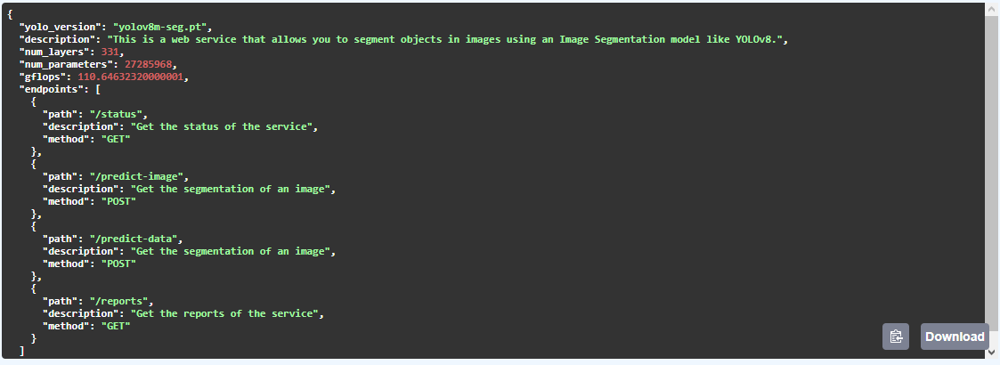
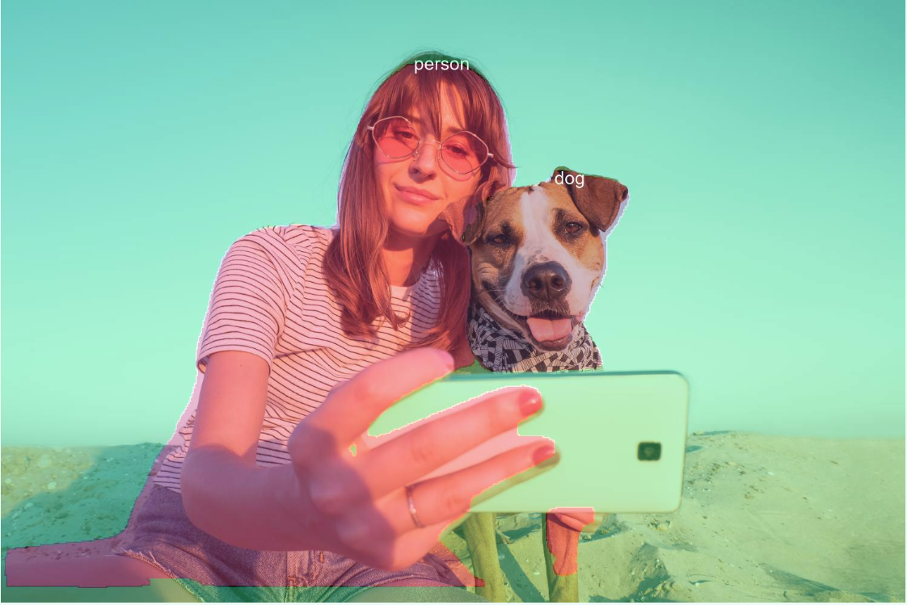
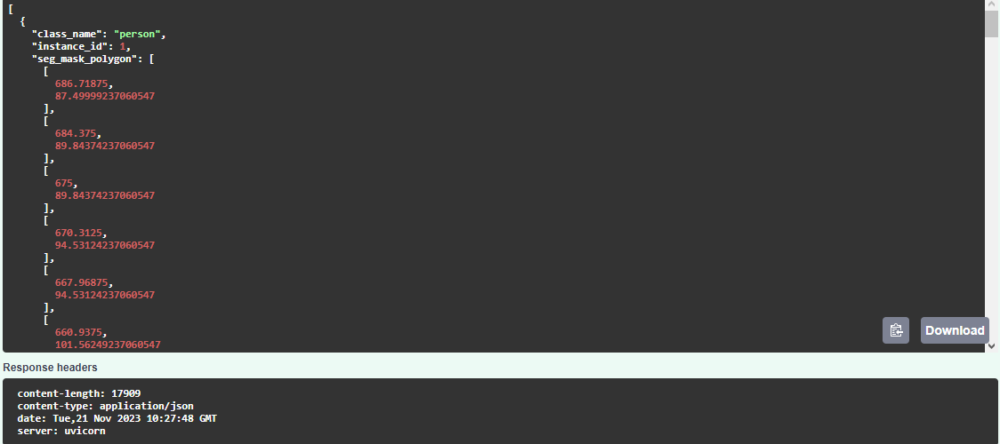
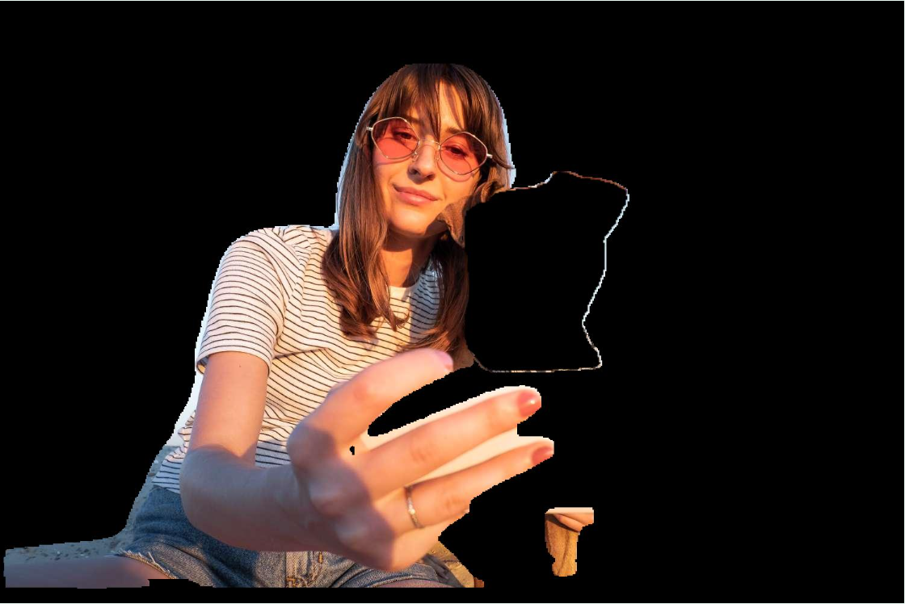
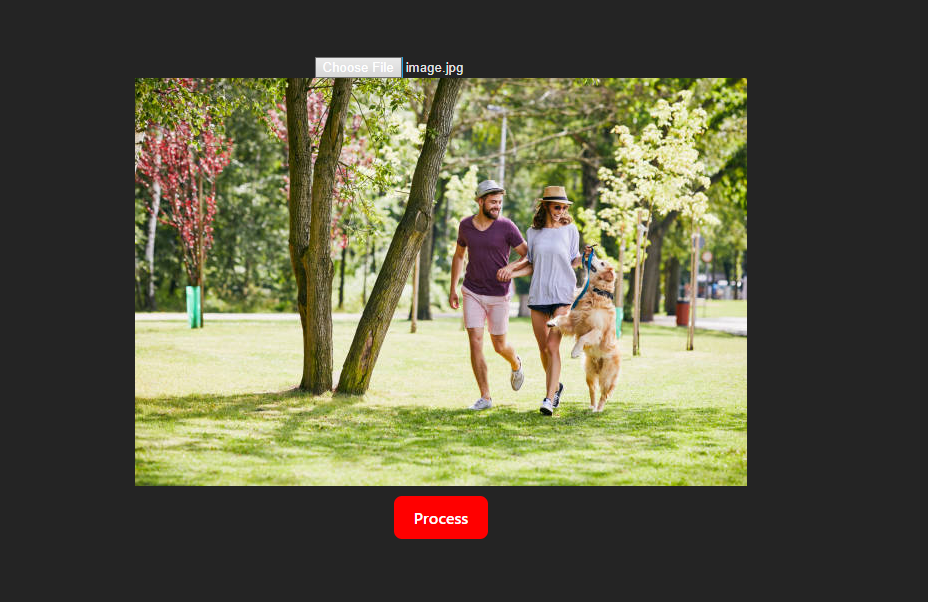
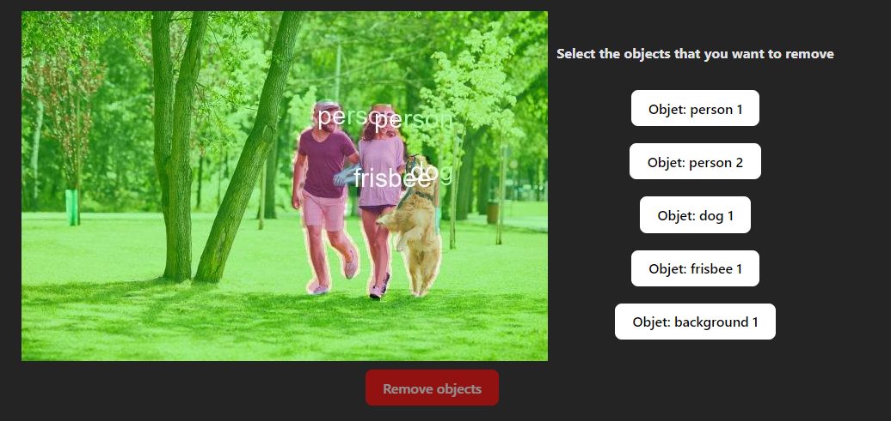
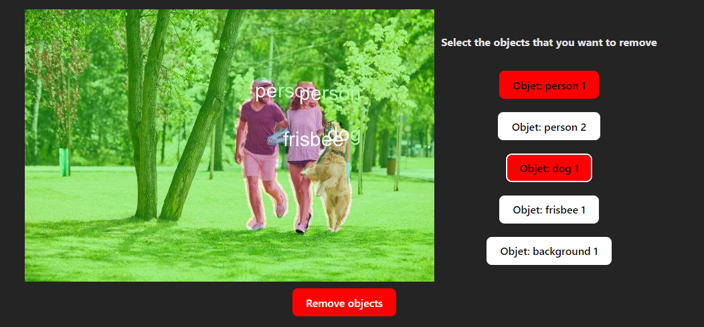

# Servicio Web con FastAPI y modelos de Machine Learning (YOLO)

Este proyecto esta diseñado para resaltar en una imagen todos los objetos detectados mediante modelos de segmentacion de imagenes, en base a un valor de confianza (0 - 1).

Este servicio web cuenta con 4 enpoints:

- **/predict:** Este endpoint recibe una imagen y un valor de confianza (Opcional) y retorna la imagen con los objetos detectados y su area segmentada correspondiente, con un color aleatorio para cada objeto.

## Datos Personales

- **Nombre:** Dylan Imanol Chambi Frontanilla
- **Código** 55662

## Requerimientos

Asegúrate de tener instaladas las siguientes herramientas y bibliotecas antes de ejecutar el proyecto:

- [Python](https://www.python.org/): 3.10 o superior.
- [Requirements.txt](https://github.com/Dylan-Chambi/Segmentation-Object-Remover/blob/main/Backend/requirements.txt): Archivo que contiene todas las bibliotecas necesarias para ejecutar el proyecto.
- Node JS: 18 o superior

## Pasos para ejecutar el proyecto

1. **Clonar el Repositorio:**
   ```bash
   git clone https://github.com/Dylan-Chambi/Segmentation-Object-Remover.git
   cd Segmentation-Object-Remover
   ```

2. **Crear un entorno virtual:**
   ```bash
    python -m venv venv
    ```
    o
    ```bash
    conda create -n venv python=3.10
    ```

3. **Activar el entorno virtual:**
    ```bash
    source venv/bin/activate
    ```
    o
    ```bash
    conda activate venv
    ```
4. **Instalar las bibliotecas necesarias:**
    ```bash
    pip install -r Backend/requirements.txt
    cd Frontend && npm install && cd ..
    ```

5. **Ejecutar el proyecto:**
    ```bash
    python Backend/app.py
    cd Frontend && npm run build && npm run start
    ```
    o
    ```bash
    (python Backend/app.py) & (cd Frontend && npm run build && npm run start)
    ```

### Ejemplo de uso (Backend)

- **Endpoint:** http://localhost:8000/status
    - **Method:** GET
    - **Response:**
        

- **Endpoint:** http://localhost:8000/predict-image
    - **Method:** POST
    - **Body:**
        - Imagen:
            
        - Valor de confianza: 0.5
    - **Response:**
        

- **Endpoint:** http://localhost:8000/predict-data
    - **Method:** POST
    - **Body:**
        - Imagen:
            
        - Valor de confianza: 0.5
    - **Response:**
        

- **Endpoint:** http://localhost:8000/remove-items-bg
    - **Method:** POST
    - **Body:**
        - Imagen:
            
        - Valor de confianza: 0.5
        - Items a remover:
            ```json
            [
                {
                    "class_name": "background", 
                    "instance_id": 1
                }, 
                {
                    "class_name": "dog",
                    "instance_id": 1
                }
            ]
            ```        
    - **Response:**
        
- **Endpoint:** http://localhost:8000/reports
    - **Method:** GET
    - **Response:**
        


### Ejemplo de uso (Frontend)

- **URL:** http://localhost:9000
- **Steps guide:**
    - **Step 1:** Seleccionar una imagen.
        
    - **Step 2:** Visualizar la imagen seleccionada.
        
    - **Step 3:** Visualización de los segmentos de objetos
        
    - **Step 4:** Selección de los objetos a remover
        
    - **Step 5:** Visualización de la imagen con los objetos removidos
        